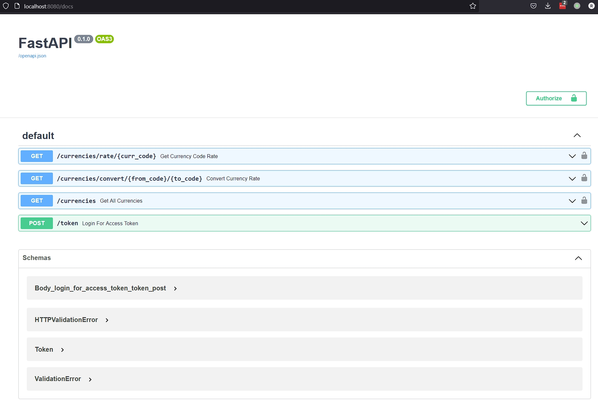
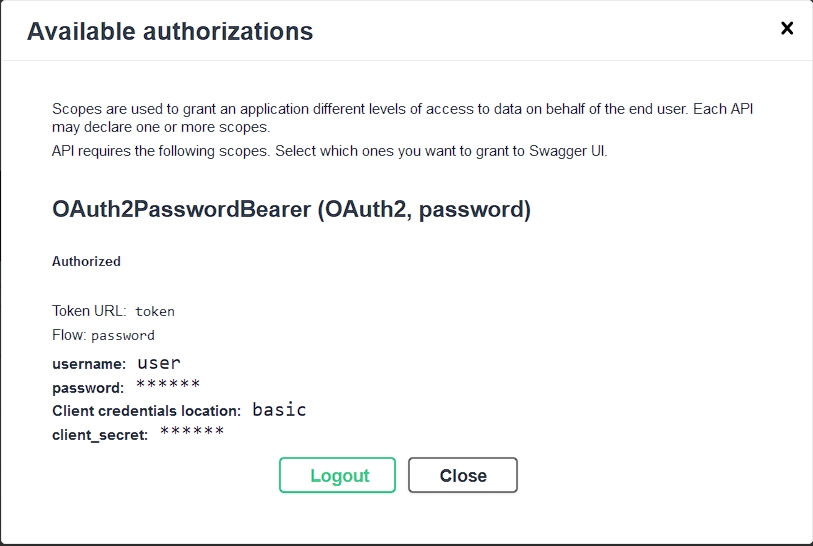

# Currency Converter API using FastAPI

A simple FastAPI based currency converter API using micro services architecture.

FastAPI &check;

Async &check;

Micro Services &check;

Tests Automation &check;

CI/CD Ready &check;

REST API &check;

Redis Cache &check;

SQLAlchemy/MySQL &check;

## Component services of the API

The API is implemented using three separate services running in docker containers and orechestrated using docker compose.

1. Database Updater Service

    This service perpetually updates the MySQL server running in the Database container.

2. MySQL Datbase Service

    A container running MySQL server acts as the back end from which client requests to the API are fulfilled.

3. FastAPI Currency Converter Service

    This service exposes the API endpoints for the currency converter service.

## Running the Currency Converter API Services

The services run inside docker containers. A `docker-compose.yml` file is provided to orchesrate the services. Once the containers are up and running the API endpoints are available at `http://localhost:8080`

Below are the steps for running the Currency converter API.

1. Install [Docker Desktop](https://docs.docker.com/desktop/install/windows-install/) for windows.
2. Clone this repository to your local machine

    ```
    git clone https://github.com/s-raza/currency-converter-api.git
    ```

3. Change to the `currency-converter-api` directory, which contains the `docker-compose.yml` file

   ```
   >cd currency-converter-api
   ```
4. Copy the `.env-template` file to `.env`, all the settings in it can be left as they are for local testing purposes.
5. Run docker compose with the `--build` switch

   ```
   docker compose up --build -d
   ```
6. Once all the containers are up and running, the API endpoints will be available at `http://localhost:8080`


## Documentation

### API Documentation

The API documentation will be available at `http://localhost:8080/docs` once all the docker containers are up.

**API Documentation**

<br>


### Code documentation

Code documentation can be accessed from the  [docs](https://htmlpreview.github.io/?https://github.com/s-raza/currency-converter-api/blob/master/docs/build/html/index.html) folder of this repository. The code documentation is pre-built using [Sphinx](https://www.sphinx-doc.org/en/master/)

Alternatively the code documentation can be read directly from the docstrings in the source code.

## API Endpoints

The API requires authentication. A default user with credentials `user:pass123` is added to the database when the Currency API service starts.

**Login Dialog**

<br>


**Successful Login**

<br>

### Endpoint Summary

1. `GET`: **/currencies/rate/{curr_code}**

   Get the latest currency rate of the currency code `curr_code`. If a parameter `on_date` is provided the last rate recorded on that particular date is returned.

   If `on_date` parameter is not provided, the absolute last rate recorded for the given currency code is returned for `curr_code`

   The accepted date format is "%d-%m-%Y", any other format will result in a `Bad Request` response.

2. `GET`: **/currencies/convert/{from_code}/{to_code}**

   Convert the amount given in the `amount` query parameter from `from_code` currency code to `to_code` currency code.

   If a parameter `on_date` is provided the last rates recorded for the `from_code` currency code and `to_code` on that particular date are used in the conversion calculation.

   If `on_date` parameter is not provided, the absolute last rates recorded for the `from_code` currency code and `to_code` are used in the conversion calculation.

   The accepted date format is "%d-%m-%Y", any other format will result in a `Bad Request` response.

3. `GET`: **/currencies**

   Get a list of all the currencies available for conversion from the database.

## Tests

Tests are implemented using Python’s `pytest` module and a live MySQL server using docker.

A docker container is started upon initiating tests using pytest.

Pytest waits for the docker container to startup before connecting to it, and executing the tests using the MySQL server running inside it.

Before running tests copy the `tests/.env-template` file to `tests/.env`, all the settings in it can be left as they are for local testing purposes.


**Test Run**
```
>pytest -s
    ======= test session starts =======
    platform win32 -- Python 3.9.5, pytest-7.1.2, pluggy-1.0.0
    rootdir: C:\currency-converter
    plugins: anyio-3.6.1, asyncio-0.19.0, cov-2.12.1
    asyncio: mode=strict
    collected 7 items

    tests\test_db.py 26-Jul-2022 06:49:44PM [INFO] Tests: Starting MySQL container
    26-Jul-2022 06:49:48PM [INFO] Tests: Container startup initiated
    26-Jul-2022 06:49:49PM [INFO] Engine Connection: Waiting for Database container to finish startup
    26-Jul-2022 06:49:54PM [INFO] Engine Connection: Waiting for Database container to finish startup
    26-Jul-2022 06:49:59PM [INFO] Engine Connection: Waiting for Database container to finish startup
    26-Jul-2022 06:50:04PM [INFO] Engine Connection: Waiting for Database container to finish startup
    26-Jul-2022 06:50:09PM [INFO] Engine Connection: Waiting for Database container to finish startup
    26-Jul-2022 06:50:14PM [INFO] Engine Connection: Waiting for Database container to finish startup
    26-Jul-2022 06:50:19PM [INFO] Engine Connection: Waiting for Database container to finish startup
    26-Jul-2022 06:50:26PM [INFO] Tests: Opening DB connection and starting tests
    .......26-Jul-2022 06:50:30PM [INFO] Tests: Tests completed, DB connection closed
    26-Jul-2022 06:50:30PM [INFO] Tests: Stopping MySQL container
    26-Jul-2022 06:50:34PM [INFO] Tests: Stopped


    ======= 7 passed in 14.57s =======
```

## Redis Cache

Redis middleware is implemented for the purpose of caching responses.

The value ``REDIS__EXPIRE_SECONDS`` from the `.env` file is used to set the expiry of a cached key, value pair that is cached using Redis.

Once the number of seconds that are set pass, the entry is deleted from Redis cache. This forces a fresh query to the database upon the next request to the same endpoint
with the same request path and query parameters.

The caching is applied selectively only to the requests that have the api path prefix present in them. This is to avoid caching any other requests that are related to authentication and error responses.

`Key`     : Combination of API request path and query parameters

`Value`   : API response after querying the database.

## Planned Updates

1. Add a caching middleware layer using Redis running in a separate container. &check;
2. Increase tests coverage.
3. Add more endpoints. E.g.

    1. Highest/Lowest rate for a currency on a given day
    2. Highest/Lowest rate for a currency between two dates.

4. Interactive front end to visualize trends in currency rates using React.
5. Closer integration of Pydantic and SQLAlchemy models in FastAPI.
