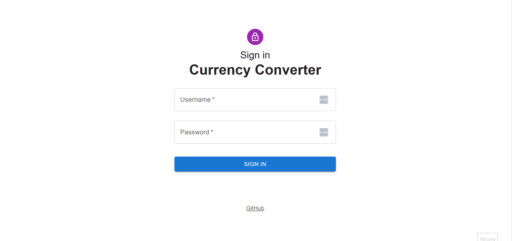
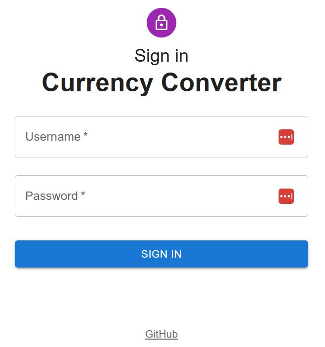
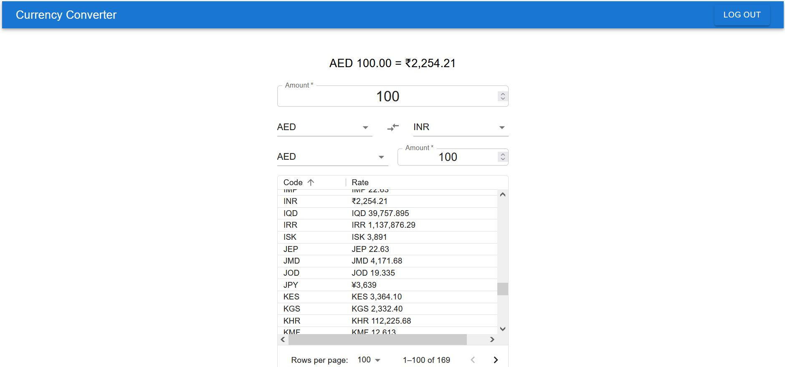
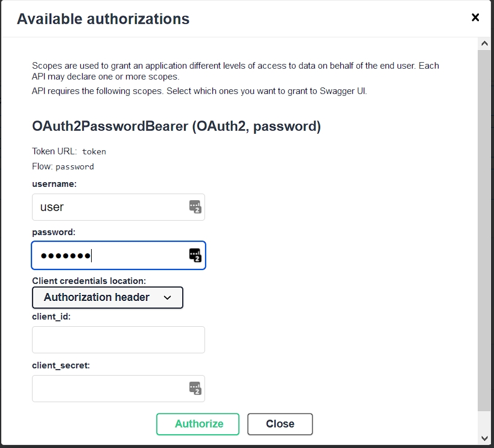

# Currency Converter App using React+FastAPI+Docker+NGINX
[](https://htmlpreview.github.io/?https://github.com/s-raza/currency-converter-api/blob/master/backend/docs/build/html/index.html)



<br>

A simple React+FastAPI based currency converter using micro services architecture.

FastAPI backend &check;

React front end for a currency converter &check;

Token based authentication with Username and Password &check;

Async &check;

Micro Services &check;

Tests Automation &check;

CI/CD Ready &check;

REST API &check;

Redis Cache &check;

SQLAlchemy/MySQL &check;

## Component services of the API

The API is implemented using five separate services running in docker containers and orechestrated using docker compose.

1. Database Updater Service

    This service perpetually updates the MySQL server running in the Database container.

2. MySQL Database Service

    A container running MySQL server acts as the back end from which client requests to the API are fulfilled.

3. FastAPI Currency Converter Service

    This service exposes the API endpoints for the currency converter service.

4. Redis Cache

   Cache API responses in Redis to avoid the overhead of querying the MySQL database. This is implemented as a middleware in the FastAPI service, that connects to this Redis service for all its caching needs.

5. React frontend service

    Frontend interface that consumes the backend FastAPI service to implement various features like a currency converter, table with latest currency rates, etc.

## Running the Currency Converter Services

The services run inside docker containers. A `docker-compose.yml` file is provided to orchesrate the services. Once the containers are up and running the API endpoints are available at `http://localhost:8080` and the React frontend is accessible from `http://localhost:3002`

Below are the steps for running the Currency converter API.

1. Install [Docker](https://docs.docker.com/get-docker/).
2. Clone this repository to your local machine.

    ```
    git clone https://github.com/s-raza/currency-converter-api.git
    ```

3. Change to the `currency-converter-api` directory, which contains the `docker-compose.yml` file.

   ```
   >cd currency-converter-api
   ```
4. Copy the `.env-template` file to `.env`, all the settings in it can be left as they are for local testing purposes.
5. Run docker compose
   1. To build and run the React frontend with Nginx. The React frontend will be accessible from `http://localhost:3002`, API endpoints will be available at `http://localhost:8080`

      ```
      docker compose up prod-server --build -d
      ```
   2. To run the frontend using the webpack dev server included with React. The React frontend will be accessible from `http://localhost:3002`, API endpoints will be available at `http://localhost:8080`

      ```
      docker compose up dev-server --build -d
      ```
   3. To run only the FastAPI backend. The endpoints will be available at `http://localhost:8080`

      ```
      docker compose up api --build -d
      ```
   4. To run only the updater that updates the MySQL database with the latest rates.

      ```
      docker compose up updater --build -d
      ```
## Stopping the Services

To stop the containers run the below command from the same directory in which the `docker-compose.yml` file is present.

```
docker compose down -v
```
## React Frontend

### Login Interface


<br>

Sign in with pre-defined credentials user:pass123


<br>

The currency converter is accessible after a successfull login.

## FastAPI Backend

### API Documentation

The API documentation is available at `http://localhost:8080/docs`

**Swagger UI API Docs**

<br>

### Code documentation

Code documentation can be accessed from the  [docs](https://htmlpreview.github.io/?https://github.com/s-raza/currency-converter-api/blob/master/backend/docs/build/html/index.html) folder of this repository. The code documentation is pre-built using [Sphinx](https://www.sphinx-doc.org/en/master/)

Alternatively the code documentation can be read directly from the docstrings in the source code.

## API Endpoints

The API requires authentication. A default user with credentials `user:pass123` is added to the database when the Currency API service starts.

**Swagger UI Login Dialog**

<br>


**Swagger UI Successful Login**

<br>

### Endpoint Summary

1. `GET`: **/currencies/rates/{curr_code}**

   Get the latest currency rate of the currency code `curr_code`. If a parameter `on_date` is provided the last rate recorded on that particular date is returned.

   If `on_date` parameter is not provided, the absolute last rate recorded for the given currency code is returned for `curr_code`

   The accepted date format is "%d-%m-%Y", any other format will result in a `Bad Request` response.

2. `GET`: **/currencies/rates**

   Get the latest rates of all the currencies available. If a parameter `on_date` is provided the last rate recorded on that particular date is returned for each currency

   If `on_date` parameter is not provided, the absolute last rates recorded for all the currency codes is returned.

   The accepted date format is "%d-%m-%Y", any other format will result in a `Bad Request` response.

3. `GET`: **/currencies/convert/{from_code}/{to_code}**

   Convert the amount given in the `amount` query parameter from `from_code` currency code to `to_code` currency code.

   If a parameter `on_date` is provided the last rates recorded for the `from_code` currency code and `to_code` on that particular date are used in the conversion calculation.

   If `on_date` parameter is not provided, the absolute last rates recorded for the `from_code` currency code and `to_code` are used in the conversion calculation.

   The accepted date format is "%d-%m-%Y", any other format will result in a `Bad Request` response.

4. `GET`: **/currencies**

   Get a list of all the currencies available for conversion from the database.

## Tests

Tests are implemented using Python’s `pytest` and a live MySQL server using docker.

A docker container is started upon initiating tests using pytest.

Pytest waits for the docker container to startup before connecting to it, and executing the tests using the MySQL server running inside it.

Before running tests copy the `tests/.env-template` file to `tests/.env`, all the settings in it can be left as they are for local testing purposes.


**Test Run**
```
> pytest
=========================== test session starts ===========================
platform win32 -- Python 3.9.0, pytest-7.1.2, pluggy-1.0.0
rootdir: D:\Development\currency-converter-api
plugins: anyio-3.6.1, asyncio-0.19.0, cov-2.12.1, typeguard-2.13.3
asyncio: mode=strict
collected 13 items

tests\test_api.py ....                                                                                                        [ 30%]
tests\test_db.py .........                                                                                                    [100%]

=========================== 13 passed in 76.00s (0:01:16) ===========================
```

## Redis Cache

Redis middleware is implemented for the purpose of caching responses.

The value ``REDIS__EXPIRE_SECONDS`` from the `.env` file is used to set the expiry of a cached key, value pair that is cached using Redis.

Once the number of seconds that are set pass, the entry is deleted from Redis cache. This forces a fresh query to the database upon the next request to the same endpoint
with the same request path and query parameters.

The caching is applied selectively only to the requests that have the api path prefix present in them. This is to avoid caching any other requests that are related to authentication and error responses.

`Key`     : Combination of API request path and query parameters

`Value`   : API response after querying the database.

## Planned Updates

1. Add a caching middleware layer using Redis running in a separate container. &check;
2. Use nginx container for deployment. &check;
3. Add more endpoints. E.g.

    1. Highest/Lowest rate for a currency on a given day
    2. Highest/Lowest rate for a currency between two dates.
    3. Latest rates of all currencies with reference to a   base currency. &check;

4. Interactive front end for a currency converter using React. &check;
5. Interactive front end to visualize trends in currency rates using React.
6. Closer integration of Pydantic and SQLAlchemy models in FastAPI.
